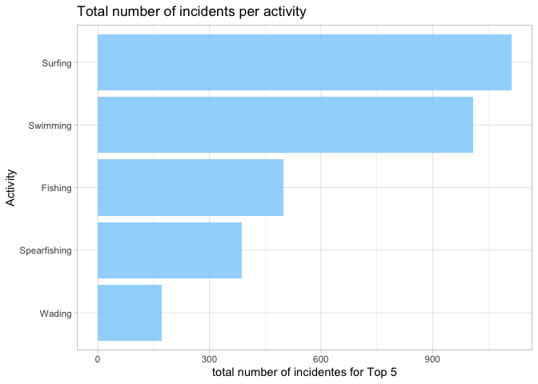

## Instructions
Answer the following questions and complete the exercises in RMarkdown. Please embed all of your code and push your final work to your repository. Your code must be organized, clean, and run free from errors. Remember, you must remove the `#` for any included code chunks to run. Be sure to add your name to the author header above. 

Your code must knit in order to be considered. If you are stuck and cannot answer a question, then comment out your code and knit the document.  

Don't forget to answer any questions that are asked in the prompt. Some questions will require a plot, but others do not- make sure to read each question carefully.  

For the questions that require a plot, make sure to have clearly labeled axes and a title. Keep your plots clean and professional-looking, but you are free to add color and other aesthetics.  

Be sure to follow the directions and push your code to your repository.

## Background
In the `data` folder, you will find data about global shark attacks. The data are updated continuously, and are taken from [opendatasoft](https://public.opendatasoft.com/explore/dataset/global-shark-attack/table/?flg=en-us&disjunctive.country&disjunctive.area&disjunctive.activity).  

## Load the libraries

```r
library("tidyverse")
library("janitor")
library("naniar")
```

## Load the data
Run the following code chunk to import the data.

```r
global_sharks <- read_csv("data/global-shark-attack.csv") %>% clean_names()
```

## Questions
1. (2 points) Start by doing some data exploration using your preferred function(s). What is the structure of the data? Where are the missing values and how are they represented?  

```r
glimpse(global_sharks)
```

```
## Rows: 6,890
## Columns: 21
## $ date                   <date> 2023-07-29, 2023-04-22, 2023-03-02, 2023-02-18…
## $ year                   <dbl> 2023, 2023, 2023, 2023, 2022, 2022, 2021, 2021,…
## $ type                   <chr> "Unprovoked", "Unprovoked", "Unprovoked", "Ques…
## $ country                <chr> "USA", "AUSTRALIA", "SEYCHELLES", "ARGENTINA", …
## $ area                   <chr> "Florida", "Western Australia", "Praslin Island…
## $ location               <chr> "Tampa Bay", "Lucy's Beach", NA, "Chubut Provin…
## $ activity               <chr> "Swimming", "Surfing", "Snorkeling", NA, "Snork…
## $ name                   <chr> "Natalie Branda", "Max Marsden", "Arthur \xc9",…
## $ sex                    <chr> "F", "M", "M", "M", "F", "M", "M", "M", "M", "M…
## $ age                    <chr> "26", "30", "6", "32", NA, "21.0", "15.0", "73.…
## $ injury                 <chr> "Superficial injuries to abomen and thighs", "B…
## $ fatal_y_n              <chr> "N", "N", "UNKNOWN", "UNKNOWN", "N", "N", "N", …
## $ time                   <chr> "20h00", "07h15", "Afternoon", NA, "12h30", "15…
## $ species                <chr> NA, "Bronze whaler shark, 1.5 m", "Lemon shark"…
## $ investigator_or_source <chr> "Fox12, 8/1/2023", "The West Australian, 4/22/2…
## $ pdf                    <chr> NA, NA, NA, NA, "2022.07.28-Cornwall.pdf", "202…
## $ href_formula           <chr> NA, NA, NA, NA, "http://sharkattackfile.net/spr…
## $ href                   <chr> NA, NA, NA, NA, "http://sharkattackfile.net/spr…
## $ case_number_19         <chr> NA, NA, NA, NA, "2022.07.28", "2022.03.09", "20…
## $ case_number_20         <chr> NA, NA, NA, NA, "2022.7.28", "2022.03.09", "202…
## $ original_order         <dbl> NA, NA, NA, NA, 6792, 6743, 6720, 6626, 6618, 6…
```


```r
summary(global_sharks)
```

```
##       date                 year          type             country         
##  Min.   :1018-06-01   Min.   :   1   Length:6890        Length:6890       
##  1st Qu.:1951-08-16   1st Qu.:1950   Class :character   Class :character  
##  Median :1988-02-02   Median :1986   Mode  :character   Mode  :character  
##  Mean   :1973-01-14   Mean   :1971                                        
##  3rd Qu.:2009-08-30   3rd Qu.:2009                                        
##  Max.   :2023-08-16   Max.   :2023                                        
##  NA's   :305          NA's   :132                                         
##      area             location           activity             name          
##  Length:6890        Length:6890        Length:6890        Length:6890       
##  Class :character   Class :character   Class :character   Class :character  
##  Mode  :character   Mode  :character   Mode  :character   Mode  :character  
##                                                                             
##                                                                             
##                                                                             
##                                                                             
##      sex                age               injury           fatal_y_n        
##  Length:6890        Length:6890        Length:6890        Length:6890       
##  Class :character   Class :character   Class :character   Class :character  
##  Mode  :character   Mode  :character   Mode  :character   Mode  :character  
##                                                                             
##                                                                             
##                                                                             
##                                                                             
##      time             species          investigator_or_source
##  Length:6890        Length:6890        Length:6890           
##  Class :character   Class :character   Class :character      
##  Mode  :character   Mode  :character   Mode  :character      
##                                                              
##                                                              
##                                                              
##                                                              
##      pdf            href_formula           href           case_number_19    
##  Length:6890        Length:6890        Length:6890        Length:6890       
##  Class :character   Class :character   Class :character   Class :character  
##  Mode  :character   Mode  :character   Mode  :character   Mode  :character  
##                                                                             
##                                                                             
##                                                                             
##                                                                             
##  case_number_20     original_order
##  Length:6890        Min.   :   2  
##  Class :character   1st Qu.:1702  
##  Mode  :character   Median :3401  
##                     Mean   :3401  
##                     3rd Qu.:5100  
##                     Max.   :6802  
##                     NA's   :91
```


```r
global_sharks %>% naniar::miss_var_summary()
```

```
## # A tibble: 21 × 3
##    variable n_miss pct_miss
##    <chr>     <int>    <dbl>
##  1 time       3518    51.1 
##  2 species    3118    45.3 
##  3 age        2982    43.3 
##  4 activity    586     8.51
##  5 sex         572     8.30
##  6 location    565     8.20
##  7 area        481     6.98
##  8 date        305     4.43
##  9 name        220     3.19
## 10 year        132     1.92
## # ℹ 11 more rows
```


```r
names(global_sharks)
```

```
##  [1] "date"                   "year"                   "type"                  
##  [4] "country"                "area"                   "location"              
##  [7] "activity"               "name"                   "sex"                   
## [10] "age"                    "injury"                 "fatal_y_n"             
## [13] "time"                   "species"                "investigator_or_source"
## [16] "pdf"                    "href_formula"           "href"                  
## [19] "case_number_19"         "case_number_20"         "original_order"
```


2. (3 points) Are there any "hotspots" for shark incidents? Make a plot that shows the total number of incidents for the top 10 countries? Which country has the highest number of incidents?


```r
top10 <- head(global_sharks%>%
  filter(country != "NA")%>%
  group_by(country)%>%
  summarize(total = n())%>%
  arrange(desc(total)),10);top10
```

```
## # A tibble: 10 × 2
##    country          total
##    <chr>            <int>
##  1 USA               2522
##  2 AUSTRALIA         1464
##  3 SOUTH AFRICA       596
##  4 NEW ZEALAND        142
##  5 PAPUA NEW GUINEA   136
##  6 BAHAMAS            132
##  7 BRAZIL             122
##  8 MEXICO             100
##  9 ITALY               72
## 10 FIJI                67
```


```r
top10%>%
  ggplot(aes(x = reorder(country, total), y = total))+
  geom_col(fill = "lightskyblue", alpha = 0.8)+
  coord_flip()+
  labs(title = "Total number of incidents per county", y = "total number of incidentes for Top 10", x = "County")+
  theme_light()
```

<!-- -->


3. (3 points) Are there months of the year when incidents are more likely to occur? Make a plot that shows the total number of incidents by month. Which month has the highest number of incidents?


```r
new_sharks <- global_sharks%>%
  select(-"year")%>%
  separate(date, into = c("year", "month", "day"), sep ="-");new_sharks
```

```
## # A tibble: 6,890 × 22
##    year  month day   type      country area  location activity name  sex   age  
##    <chr> <chr> <chr> <chr>     <chr>   <chr> <chr>    <chr>    <chr> <chr> <chr>
##  1 2023  07    29    Unprovok… USA     Flor… Tampa B… Swimming "Nat… F     26   
##  2 2023  04    22    Unprovok… AUSTRA… West… Lucy's … Surfing  "Max… M     30   
##  3 2023  03    02    Unprovok… SEYCHE… Pras… <NA>     Snorkel… "Art… M     6    
##  4 2023  02    18    Question… ARGENT… Pata… Chubut … <NA>     "Die… M     32   
##  5 2022  07    28    Unprovok… ENGLAND Corn… Penzance Snorkel… "fem… F     <NA> 
##  6 2022  03    09    Provoked  USA     Flor… New Smy… Fishing  "mal… M     21.0 
##  7 2021  12    06    Unprovok… AUSTRA… Vict… Ocean G… Swimming "Jac… M     15.0 
##  8 2021  01    22    Unprovok… USA     Hawa… Maui     Snorkel… "Jer… M     73.0 
##  9 2021  01    02    Unprovok… USA     Flor… Cocoa B… Surfing  "Kel… M     17.0 
## 10 2020  10    30    Unprovok… BAHAMAS Gran… East En… Spearfi… "Ant… M     <NA> 
## # ℹ 6,880 more rows
## # ℹ 11 more variables: injury <chr>, fatal_y_n <chr>, time <chr>,
## #   species <chr>, investigator_or_source <chr>, pdf <chr>, href_formula <chr>,
## #   href <chr>, case_number_19 <chr>, case_number_20 <chr>,
## #   original_order <dbl>
```


```r
new_sharks%>%
  filter(month != "NA")%>%
  ggplot(aes(x = as.factor(month)))+
  geom_bar(fill = "lightskyblue", alpha = 0.8)+
  labs(title = "Number of Indicants by Months", x="Month", y = "Number of Incidents")+
  theme_light()
```

<!-- -->

January has the highest number of incidents

4. (3 points) Which activity is associated with the highest number of incidents? Make a plot that compares the top 5 riskiest activities. "NA" should not be classified as an activity.

```r
top5 <- head(global_sharks%>%
  filter(activity != "NA")%>%
  group_by(activity)%>%
  summarize(total_activities = n())%>%
  arrange(desc(total_activities)), 5); top5
```

```
## # A tibble: 5 × 2
##   activity     total_activities
##   <chr>                   <int>
## 1 Surfing                  1112
## 2 Swimming                 1009
## 3 Fishing                   498
## 4 Spearfishing              387
## 5 Wading                    171
```

```r
top5%>%
  ggplot(aes(x = reorder(activity, total_activities), y = total_activities))+
  geom_col(fill = "lightskyblue", alpha = 0.8)+
  coord_flip()+
  labs(title = "Total number of incidents per activity", y = "total number of incidentes for Top 5", x = "Activity")+
  theme_light()
```

<!-- -->


5. (3 points) The data include information on who was attacked. Make a plot that shows the total number of fatalities by sex- are males or females more likely to be killed by sharks?


```r
global_sharks %>%
  filter(fatal_y_n == "Y") %>%
  filter(sex == "F" | sex == "M") %>%
  group_by(sex) %>%
  summarize(fatalities = n()) %>%
  ggplot(aes(x = sex, y = fatalities, fill = sex)) +
  geom_col() +
  labs(title = "Total Number of Fatalities by Sex",
       x = "Sex",
       y = "Number of Fatalities")+
  theme_light()
```

<!-- -->

6. (3 points) Make a plot that shows the range of age for the individuals that are attacked. Make sure to restrict sex to M or F (some of the codes used are not clear). You will also need to find a way to manage the messy age column.


```r
global_sharks %>%
  filter(age != "NA") %>%
  filter(sex == "F" | sex == "M") %>%
  group_by(sex) %>%
  ggplot(aes(x = sex, y= as.numeric(age), fill = sex))+
  geom_boxplot()+ 
  labs(title = "Range of Ages for Shark Attack Victims by Sex",
       x = "Sex",
       y = "Age")+
  theme_light()
```

```
## Warning in FUN(X[[i]], ...): NAs introduced by coercion

## Warning in FUN(X[[i]], ...): NAs introduced by coercion
```

```
## Warning: Removed 120 rows containing non-finite values (`stat_boxplot()`).
```

<!-- -->

7. (3 points) In the United States, what are the top 5 states where shark attacks have been recorded since 1950? Make a plot that compares the number of incidents for these 5 states.


```r
us5 <- new_sharks%>%
  filter(country == "USA", year >= 1950) %>% 
  group_by(area) %>%
  summarise(Incidents = n()) %>%
  arrange(desc(Incidents)) %>%
  slice_head(n = 5); us5
```

```
## # A tibble: 5 × 2
##   area           Incidents
##   <chr>              <int>
## 1 Florida             1086
## 2 California           296
## 3 Hawaii               273
## 4 South Carolina       134
## 5 North Carolina        96
```

```r
ggplot(us5, aes(x = reorder(area, Incidents), y = Incidents))+
  geom_col(fill = "steelblue") +
  labs(title = "Top 5 US States by Shark Attack Incidents Since 1950",
       x = "State",
       y = "Number of Incidents") + theme_light()
```

<!-- -->

8. (3 points) Make a new object that limits the data to only include attacks attributed to Great White Sharks. This is trickier than it sounds, you should end up with 494 observations. Look online and adapt code involving `str_detect`. Which country has the highest number of Great White Shark attacks?

```r
white_sharks <- global_sharks %>%
  filter(str_detect(species, "White"))%>%
  group_by(country) %>%
  summarise(Incidents = n()) %>%
  arrange(desc(Incidents)) %>%
  slice_head(n = 1); white_sharks
```

```
## # A tibble: 1 × 2
##   country Incidents
##   <chr>       <int>
## 1 USA           151
```
USA has the highest number of Great White Shark attacks

9. (4 points) Use faceting to compare the number of fatal and non-fatal attacks for the top 5 countries with the highest number of Great White Shark attacks.


```r
top_white <- global_sharks %>%
  filter(str_detect(species, "White"))%>%
  group_by(country) %>%
  summarise(Incidents = n()) %>%
  arrange(desc(Incidents)) %>%
  slice_head(n = 5);top_white
```

```
## # A tibble: 5 × 2
##   country      Incidents
##   <chr>            <int>
## 1 USA                151
## 2 AUSTRALIA          135
## 3 SOUTH AFRICA       124
## 4 NEW ZEALAND         17
## 5 ITALY               16
```

```r
global_sharks %>%
  filter(country %in% top_white$country)%>%
  filter(fatal_y_n == "Y"| fatal_y_n == "N")%>%
  ggplot( aes(x = fatal_y_n, fill = fatal_y_n)) +
  geom_bar() +
  facet_wrap(~ country, scales = "free_y") +  # Facet by country
  labs(title = "Comparison of Fatal and Non-Fatal Great White Shark Attacks",
       x = "Fatal Attack",
       y = "Number of Attacks",
       fill = "Attack Type") + theme_light()
```

<!-- -->


10. (3 points) Using the `global_sharks` data, what is one question that you are interested in exploring? Write the question and answer it using a plot or table.

Make a plot that shows the total number of incidents by top 5 year. Which year has the highest number of incidents?

```r
Top5_years <- global_sharks %>%
  filter(year != "NA")%>%
  group_by(year) %>%
  summarise(TotalIncidents = n()) %>%
  arrange(desc(TotalIncidents)) %>%
  slice_head(n = 5);Top5_years
```

```
## # A tibble: 5 × 2
##    year TotalIncidents
##   <dbl>          <int>
## 1  2015            143
## 2  2017            139
## 3  2016            131
## 4  2011            128
## 5  2014            126
```

```r
ggplot(Top5_years, aes(x = reorder(year, TotalIncidents), y = TotalIncidents)) +
  geom_col(fill = "lightskyblue") +
  labs(title = "Top 5 Years with Most Shark Incidents",
       x = "Year",
       y = "Number of Incidents") +
  theme_light()
```

<!-- -->


