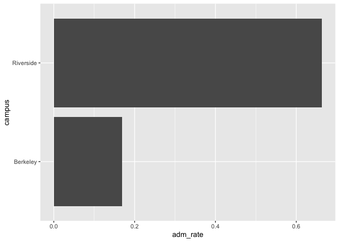

## Instructions
Answer the following questions and complete the exercises in RMarkdown. Please embed all of your code and push your final work to your repository. Your final lab report should be organized, clean, and run free from errors. Remember, you must remove the `#` for the included code chunks to run. Be sure to add your name to the author header above.  

Make sure to use the formatting conventions of RMarkdown to make your report neat and clean!  

## Load the libraries

```r
library(tidyverse)
library(janitor)
library(here)
library(naniar)
```

For this homework, we will take a departure from biological data and use data about California colleges. These data are a subset of the national college scorecard (https://collegescorecard.ed.gov/data/). Load the `ca_college_data.csv` as a new object called `colleges`.

```r
colleges <- read_csv("data/ca_college_data.csv")
```

```
## Rows: 341 Columns: 10
## ── Column specification ────────────────────────────────────────────────────────
## Delimiter: ","
## chr (4): INSTNM, CITY, STABBR, ZIP
## dbl (6): ADM_RATE, SAT_AVG, PCIP26, COSTT4_A, C150_4_POOLED, PFTFTUG1_EF
## 
## ℹ Use `spec()` to retrieve the full column specification for this data.
## ℹ Specify the column types or set `show_col_types = FALSE` to quiet this message.
```

```r
colleges <- clean_names(colleges)
```

The variables are a bit hard to decipher, here is a key:  

INSTNM: Institution name  
CITY: California city  
STABBR: Location state  
ZIP: Zip code  
ADM_RATE: Admission rate  
SAT_AVG: SAT average score  
PCIP26: Percentage of degrees awarded in Biological And Biomedical Sciences  
COSTT4_A: Annual cost of attendance  
C150_4_POOLED: 4-year completion rate  
PFTFTUG1_EF: Percentage of undergraduate students who are first-time, full-time degree/certificate-seeking undergraduate students  

1. Use your preferred function(s) to have a look at the data and get an idea of its structure. Make sure you summarize NA's and determine whether or not the data are tidy. You may also consider dealing with any naming issues.


```r
str(colleges)
```

```
## spc_tbl_ [341 × 10] (S3: spec_tbl_df/tbl_df/tbl/data.frame)
##  $ instnm       : chr [1:341] "Grossmont College" "College of the Sequoias" "College of San Mateo" "Ventura College" ...
##  $ city         : chr [1:341] "El Cajon" "Visalia" "San Mateo" "Ventura" ...
##  $ stabbr       : chr [1:341] "CA" "CA" "CA" "CA" ...
##  $ zip          : chr [1:341] "92020-1799" "93277-2214" "94402-3784" "93003-3872" ...
##  $ adm_rate     : num [1:341] NA NA NA NA NA NA NA NA NA NA ...
##  $ sat_avg      : num [1:341] NA NA NA NA NA NA NA NA NA NA ...
##  $ pcip26       : num [1:341] 0.0016 0.0066 0.0038 0.0035 0.0085 0.0151 0 0.002 0.0021 0.0324 ...
##  $ costt4_a     : num [1:341] 7956 8109 8278 8407 8516 ...
##  $ c150_4_pooled: num [1:341] NA NA NA NA NA ...
##  $ pftftug1_ef  : num [1:341] 0.355 0.541 0.357 0.382 0.275 ...
##  - attr(*, "spec")=
##   .. cols(
##   ..   INSTNM = col_character(),
##   ..   CITY = col_character(),
##   ..   STABBR = col_character(),
##   ..   ZIP = col_character(),
##   ..   ADM_RATE = col_double(),
##   ..   SAT_AVG = col_double(),
##   ..   PCIP26 = col_double(),
##   ..   COSTT4_A = col_double(),
##   ..   C150_4_POOLED = col_double(),
##   ..   PFTFTUG1_EF = col_double()
##   .. )
##  - attr(*, "problems")=<externalptr>
```

```r
anyNA(colleges)
```

```
## [1] TRUE
```

```r
summary(colleges)
```

```
##     instnm              city              stabbr              zip           
##  Length:341         Length:341         Length:341         Length:341        
##  Class :character   Class :character   Class :character   Class :character  
##  Mode  :character   Mode  :character   Mode  :character   Mode  :character  
##                                                                             
##                                                                             
##                                                                             
##                                                                             
##     adm_rate         sat_avg         pcip26           costt4_a    
##  Min.   :0.0807   Min.   : 870   Min.   :0.00000   Min.   : 7956  
##  1st Qu.:0.4581   1st Qu.: 985   1st Qu.:0.00000   1st Qu.:12578  
##  Median :0.6370   Median :1078   Median :0.00000   Median :16591  
##  Mean   :0.5901   Mean   :1112   Mean   :0.01981   Mean   :26685  
##  3rd Qu.:0.7461   3rd Qu.:1237   3rd Qu.:0.02457   3rd Qu.:39289  
##  Max.   :1.0000   Max.   :1555   Max.   :0.21650   Max.   :69355  
##  NA's   :240      NA's   :276    NA's   :35        NA's   :124    
##  c150_4_pooled     pftftug1_ef    
##  Min.   :0.0625   Min.   :0.0064  
##  1st Qu.:0.4265   1st Qu.:0.3212  
##  Median :0.5845   Median :0.5016  
##  Mean   :0.5705   Mean   :0.5577  
##  3rd Qu.:0.7162   3rd Qu.:0.8117  
##  Max.   :0.9569   Max.   :1.0000  
##  NA's   :221      NA's   :53
```


2. Which cities in California have the highest number of colleges?

```r
colleges%>%
  group_by(city)%>%
  summarize(hi_num = n_distinct(instnm))%>%
  arrange(desc(hi_num))
```

```
## # A tibble: 161 × 2
##    city          hi_num
##    <chr>          <int>
##  1 Los Angeles       24
##  2 San Diego         18
##  3 San Francisco     15
##  4 Sacramento        10
##  5 Berkeley           9
##  6 Oakland            9
##  7 Claremont          7
##  8 Pasadena           6
##  9 Fresno             5
## 10 Irvine             5
## # ℹ 151 more rows
```


3. Based on your answer to #2, make a plot that shows the number of colleges in the top 10 cities.


```r
colleges%>%
  group_by(city)%>%
  summarize(hi_num = n_distinct(instnm))%>%
  arrange(desc(hi_num))%>%
  top_n(10, hi_num )%>%
  ggplot(aes(x = city, y = hi_num))+
  geom_col()+
  coord_flip()
```

<!-- -->


4. The column `COSTT4_A` is the annual cost of each institution. Which city has the highest average cost? Where is it located?

```r
colleges%>%
  filter(costt4_a != "NA")%>%
  group_by(city, stabbr)%>%
  summarize(avg_cost = mean(costt4_a))%>%
  arrange(desc(avg_cost))
```

```
## `summarise()` has grouped output by 'city'. You can override using the
## `.groups` argument.
```

```
## # A tibble: 132 × 3
## # Groups:   city [132]
##    city                stabbr avg_cost
##    <chr>               <chr>     <dbl>
##  1 Claremont           CA        66498
##  2 Malibu              CA        66152
##  3 Valencia            CA        64686
##  4 Orange              CA        64501
##  5 Redlands            CA        61542
##  6 Moraga              CA        61095
##  7 Atherton            CA        56035
##  8 Thousand Oaks       CA        54373
##  9 Rancho Palos Verdes CA        50758
## 10 La Verne            CA        50603
## # ℹ 122 more rows
```

Claremont has the highest average cost, and it is located in CA.

5. Based on your answer to #4, make a plot that compares the cost of the individual colleges in the most expensive city. Bonus! Add UC Davis here to see how it compares :>).

```r
colleges%>%
  filter(costt4_a != "NA")%>%
  filter(city == "Claremont"| city == "Davis")%>%
  ggplot(aes(x = instnm, y = costt4_a))+
  geom_col()+
  coord_flip()
```

<!-- -->


6. The column `ADM_RATE` is the admissions rate by college and `C150_4_POOLED` is the four-year completion rate. Use a scatterplot to show the relationship between these two variables. What do you think this means?

```r
ggplot(data=colleges, mapping = aes(x = adm_rate, y = c150_4_pooled ))+
  geom_point(na.rm = T)+
  geom_smooth(method=lm, se=T, na.rm = T)
```

```
## `geom_smooth()` using formula = 'y ~ x'
```

<!-- -->
four-year completion rate and admissions rate are inversely proportional.


7. Is there a relationship between cost and four-year completion rate? (You don't need to do the stats, just produce a plot). What do you think this means?

```r
ggplot(data=colleges, mapping = aes(x = costt4_a, y = c150_4_pooled ))+
  geom_point(na.rm = T)+
  geom_smooth(method=lm, se=T, na.rm = T)
```

```
## `geom_smooth()` using formula = 'y ~ x'
```

<!-- -->

four-year completion rate and cost are proportional. 

8. The column titled `INSTNM` is the institution name. We are only interested in the University of California colleges. Make a new data frame that is restricted to UC institutions. You can remove `Hastings College of Law` and `UC San Francisco` as we are only interested in undergraduate institutions.

Remove `Hastings College of Law` and `UC San Francisco` and store the final data frame as a new object `univ_calif_final`.

Use `separate()` to separate institution name into two new columns "UNIV" and "CAMPUS".

```r
univ_calif_final <- colleges%>%
  filter_all(any_vars(str_detect(.,pattern = "University of California")))%>%
  filter(!(instnm == "University of California-Hastings College of Law" |
           instnm == "University of California-San Francisco"))%>%
  separate(instnm, into = c("univ", "campus"), sep = "-", remove = FALSE)
```

9. The column `ADM_RATE` is the admissions rate by campus. Which UC has the lowest and highest admissions rates? Produce a numerical summary and an appropriate plot.

```r
summary <- univ_calif_final%>%
  filter(adm_rate != "NA")%>%
  summarize(lowest = min(adm_rate),
            highest = max(adm_rate));summary
```

```
## # A tibble: 1 × 2
##   lowest highest
##    <dbl>   <dbl>
## 1  0.169   0.663
```

```r
univ_calif_final%>%
  filter(adm_rate == summary$lowest) # UC-berkeley
```

```
## # A tibble: 1 × 12
##   instnm        univ  campus city  stabbr zip   adm_rate sat_avg pcip26 costt4_a
##   <chr>         <chr> <chr>  <chr> <chr>  <chr>    <dbl>   <dbl>  <dbl>    <dbl>
## 1 University o… Univ… Berke… Berk… CA     94720    0.169    1422  0.105    34924
## # ℹ 2 more variables: c150_4_pooled <dbl>, pftftug1_ef <dbl>
```

```r
univ_calif_final%>%
  filter(adm_rate == summary$highest) # UC-riverside
```

```
## # A tibble: 1 × 12
##   instnm        univ  campus city  stabbr zip   adm_rate sat_avg pcip26 costt4_a
##   <chr>         <chr> <chr>  <chr> <chr>  <chr>    <dbl>   <dbl>  <dbl>    <dbl>
## 1 University o… Univ… River… Rive… CA     92521    0.663    1078  0.149    31494
## # ℹ 2 more variables: c150_4_pooled <dbl>, pftftug1_ef <dbl>
```


```r
## ggplot
univ_calif_final%>%
  filter(adm_rate != "NA")%>%
  filter(adm_rate == summary$lowest| adm_rate == summary$highest)%>%
  ggplot(aes(x = campus, y = adm_rate))+
  geom_col()+
  coord_flip()
```

<!-- -->


10. If you wanted to get a degree in biological or biomedical sciences, which campus confers the majority of these degrees? Produce a numerical summary and an appropriate plot.

```r
bio <- univ_calif_final%>%
  filter(pcip26!= "NA")%>%
  select(instnm, campus, pcip26)%>%
  arrange(desc(pcip26));bio
```

```
## # A tibble: 8 × 3
##   instnm                                 campus        pcip26
##   <chr>                                  <chr>          <dbl>
## 1 University of California-San Diego     San Diego      0.216
## 2 University of California-Davis         Davis          0.198
## 3 University of California-Santa Cruz    Santa Cruz     0.193
## 4 University of California-Los Angeles   Los Angeles    0.155
## 5 University of California-Riverside     Riverside      0.149
## 6 University of California-Santa Barbara Santa Barbara  0.108
## 7 University of California-Irvine        Irvine         0.107
## 8 University of California-Berkeley      Berkeley       0.105
```


```r
univ_calif_final%>%
  filter(pcip26!= "NA")%>%
  ggplot(aes(x = campus, y = pcip26))+
  geom_col()+
  coord_flip()
```

<!-- -->

UC San Diego confers the majority of these degrees


## Knit Your Output and Post to [GitHub](https://github.com/FRS417-DataScienceBiologists)
