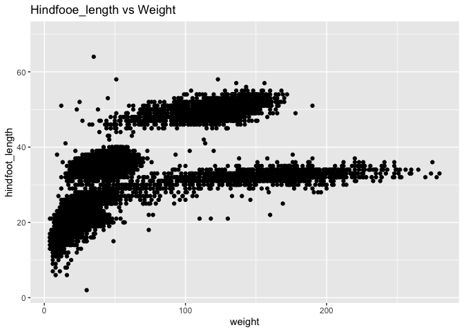

## Instructions
Answer the following questions and complete the exercises in RMarkdown. Please embed all of your code and push your final work to your repository. Your final lab report should be organized, clean, and run free from errors. Remember, you must remove the `#` for the included code chunks to run. Be sure to add your name to the author header above. For any included plots, make sure they are clearly labeled. You are free to use any plot type that you feel best communicates the results of your analysis.  

Make sure to use the formatting conventions of RMarkdown to make your report neat and clean!  

## Load the libraries

```r
library(tidyverse)
library(janitor)
library(naniar)
```

## Desert Ecology
For this assignment, we are going to use a modified data set on [desert ecology](http://esapubs.org/archive/ecol/E090/118/). The data are from: S. K. Morgan Ernest, Thomas J. Valone, and James H. Brown. 2009. Long-term monitoring and experimental manipulation of a Chihuahuan Desert ecosystem near Portal, Arizona, USA. Ecology 90:1708.

```r
deserts <- read_csv("data/surveys_complete.csv") %>% clean_names()
```

```
## Rows: 34786 Columns: 13
## ── Column specification ────────────────────────────────────────────────────────
## Delimiter: ","
## chr (6): species_id, sex, genus, species, taxa, plot_type
## dbl (7): record_id, month, day, year, plot_id, hindfoot_length, weight
## 
## ℹ Use `spec()` to retrieve the full column specification for this data.
## ℹ Specify the column types or set `show_col_types = FALSE` to quiet this message.
```

1. Use the function(s) of your choice to get an idea of its structure, including how NA's are treated. Are the data tidy?  

```r
str(deserts)
```

```
## spc_tbl_ [34,786 × 13] (S3: spec_tbl_df/tbl_df/tbl/data.frame)
##  $ record_id      : num [1:34786] 1 2 3 4 5 6 7 8 9 10 ...
##  $ month          : num [1:34786] 7 7 7 7 7 7 7 7 7 7 ...
##  $ day            : num [1:34786] 16 16 16 16 16 16 16 16 16 16 ...
##  $ year           : num [1:34786] 1977 1977 1977 1977 1977 ...
##  $ plot_id        : num [1:34786] 2 3 2 7 3 1 2 1 1 6 ...
##  $ species_id     : chr [1:34786] "NL" "NL" "DM" "DM" ...
##  $ sex            : chr [1:34786] "M" "M" "F" "M" ...
##  $ hindfoot_length: num [1:34786] 32 33 37 36 35 14 NA 37 34 20 ...
##  $ weight         : num [1:34786] NA NA NA NA NA NA NA NA NA NA ...
##  $ genus          : chr [1:34786] "Neotoma" "Neotoma" "Dipodomys" "Dipodomys" ...
##  $ species        : chr [1:34786] "albigula" "albigula" "merriami" "merriami" ...
##  $ taxa           : chr [1:34786] "Rodent" "Rodent" "Rodent" "Rodent" ...
##  $ plot_type      : chr [1:34786] "Control" "Long-term Krat Exclosure" "Control" "Rodent Exclosure" ...
##  - attr(*, "spec")=
##   .. cols(
##   ..   record_id = col_double(),
##   ..   month = col_double(),
##   ..   day = col_double(),
##   ..   year = col_double(),
##   ..   plot_id = col_double(),
##   ..   species_id = col_character(),
##   ..   sex = col_character(),
##   ..   hindfoot_length = col_double(),
##   ..   weight = col_double(),
##   ..   genus = col_character(),
##   ..   species = col_character(),
##   ..   taxa = col_character(),
##   ..   plot_type = col_character()
##   .. )
##  - attr(*, "problems")=<externalptr>
```


```r
summary(deserts)
```

```
##    record_id         month             day            year         plot_id     
##  Min.   :    1   Min.   : 1.000   Min.   : 1.0   Min.   :1977   Min.   : 1.00  
##  1st Qu.: 8964   1st Qu.: 4.000   1st Qu.: 9.0   1st Qu.:1984   1st Qu.: 5.00  
##  Median :17762   Median : 6.000   Median :16.0   Median :1990   Median :11.00  
##  Mean   :17804   Mean   : 6.474   Mean   :16.1   Mean   :1990   Mean   :11.34  
##  3rd Qu.:26655   3rd Qu.:10.000   3rd Qu.:23.0   3rd Qu.:1997   3rd Qu.:17.00  
##  Max.   :35548   Max.   :12.000   Max.   :31.0   Max.   :2002   Max.   :24.00  
##                                                                                
##   species_id            sex            hindfoot_length     weight      
##  Length:34786       Length:34786       Min.   : 2.00   Min.   :  4.00  
##  Class :character   Class :character   1st Qu.:21.00   1st Qu.: 20.00  
##  Mode  :character   Mode  :character   Median :32.00   Median : 37.00  
##                                        Mean   :29.29   Mean   : 42.67  
##                                        3rd Qu.:36.00   3rd Qu.: 48.00  
##                                        Max.   :70.00   Max.   :280.00  
##                                        NA's   :3348    NA's   :2503    
##     genus             species              taxa            plot_type        
##  Length:34786       Length:34786       Length:34786       Length:34786      
##  Class :character   Class :character   Class :character   Class :character  
##  Mode  :character   Mode  :character   Mode  :character   Mode  :character  
##                                                                             
##                                                                             
##                                                                             
## 
```


```r
names(deserts)
```

```
##  [1] "record_id"       "month"           "day"             "year"           
##  [5] "plot_id"         "species_id"      "sex"             "hindfoot_length"
##  [9] "weight"          "genus"           "species"         "taxa"           
## [13] "plot_type"
```


```r
naniar::miss_var_summary(deserts)
```

```
## # A tibble: 13 × 3
##    variable        n_miss pct_miss
##    <chr>            <int>    <dbl>
##  1 hindfoot_length   3348     9.62
##  2 weight            2503     7.20
##  3 sex               1748     5.03
##  4 record_id            0     0   
##  5 month                0     0   
##  6 day                  0     0   
##  7 year                 0     0   
##  8 plot_id              0     0   
##  9 species_id           0     0   
## 10 genus                0     0   
## 11 species              0     0   
## 12 taxa                 0     0   
## 13 plot_type            0     0
```

The dataset is tidy


2. How many genera and species are represented in the data? What are the total number of observations? Which species is most/ least frequently sampled in the study?

```r
unique(deserts$genus)# 26 unique genera
```

```
##  [1] "Neotoma"          "Dipodomys"        "Perognathus"      "Peromyscus"      
##  [5] "Chaetodipus"      "Sigmodon"         "Onychomys"        "Spermophilus"    
##  [9] "Reithrodontomys"  "Sylvilagus"       "Ammospermophilus" "Amphispiza"      
## [13] "Campylorhynchus"  "Calamospiza"      "Callipepla"       "Pipilo"          
## [17] "Pooecetes"        "Crotalus"         "Rodent"           "Zonotrichia"     
## [21] "Lizard"           "Sceloporus"       "Baiomys"          "Ammodramus"      
## [25] "Cnemidophorus"    "Sparrow"
```


```r
unique(deserts$species)# 40 unqiue species
```

```
##  [1] "albigula"        "merriami"        "flavus"          "eremicus"       
##  [5] "spectabilis"     "penicillatus"    "hispidus"        "torridus"       
##  [9] "ordii"           "sp."             "spilosoma"       "leucogaster"    
## [13] "megalotis"       "audubonii"       "maniculatus"     "harrisi"        
## [17] "bilineata"       "brunneicapillus" "melanocorys"     "squamata"       
## [21] "fulvescens"      "chlorurus"       "gramineus"       "fuscus"         
## [25] "viridis"         "leucophrys"      "scutalatus"      "clarki"         
## [29] "taylori"         "fulviventer"     "montanus"        "savannarum"     
## [33] "ochrognathus"    "intermedius"     "tereticaudus"    "uniparens"      
## [37] "undulatus"       "baileyi"         "leucopus"        "tigris"
```


```r
dim(deserts) # There are 34786 observations
```

```
## [1] 34786    13
```


```r
deserts%>%
  group_by(species)%>%
  summarize(count = n())%>%
  arrange(desc(count))
```

```
## # A tibble: 40 × 2
##    species      count
##    <chr>        <int>
##  1 merriami     10596
##  2 penicillatus  3123
##  3 ordii         3027
##  4 baileyi       2891
##  5 megalotis     2609
##  6 spectabilis   2504
##  7 torridus      2249
##  8 flavus        1597
##  9 eremicus      1299
## 10 albigula      1252
## # ℹ 30 more rows
```

Merriami is the most frequently sampled species in the study. 


3. What is the proportion of taxa included in this study? Show a table and plot that reflects this count.

```r
table(deserts$taxa)
```

```
## 
##    Bird  Rabbit Reptile  Rodent 
##     450      75      14   34247
```


```r
deserts%>%
  group_by(taxa)%>%
  summarize(count_taxa = n())%>%
  mutate(proportion = count_taxa/sum(count_taxa))
```

```
## # A tibble: 4 × 3
##   taxa    count_taxa proportion
##   <chr>        <int>      <dbl>
## 1 Bird           450   0.0129  
## 2 Rabbit          75   0.00216 
## 3 Reptile         14   0.000402
## 4 Rodent       34247   0.985
```


```r
deserts%>%
  ggplot(aes(taxa ,fill = taxa))+
  geom_bar()+
  scale_y_log10()
```

<!-- -->


4. For the taxa included in the study, use the fill option to show the proportion of individuals sampled by `plot_type.`

```r
deserts%>%
  ggplot(aes(taxa ,fill = plot_type))+
  geom_bar()+
  scale_y_log10()
```

<!-- -->

5. What is the range of weight for each species included in the study? Remove any observations of weight that are NA so they do not show up in the plot.

```r
deserts%>%
  ggplot(aes(species , weight))+
  geom_boxplot(na.rm = T)+
  coord_flip()+
  scale_y_log10()
```

<!-- -->

6. Add another layer to your answer from #5 using `geom_point` to get an idea of how many measurements were taken for each species.

```r
deserts%>%
  ggplot(aes(species , weight))+
  geom_boxplot(na.rm = T)+
  coord_flip()+
  geom_point()+
  scale_y_log10()
```

```
## Warning: Removed 2503 rows containing missing values (`geom_point()`).
```

<!-- -->

7. [Dipodomys merriami](https://en.wikipedia.org/wiki/Merriam's_kangaroo_rat) is the most frequently sampled animal in the study. How have the number of observations of this species changed over the years included in the study?

```r
deserts%>%
  group_by(year)%>%
  filter(genus == "Dipodomys" & species == "merriami")%>%
  summarize(number_obs = n())%>%
  arrange(desc(year))
```

```
## # A tibble: 26 × 2
##     year number_obs
##    <dbl>      <int>
##  1  2002        309
##  2  2001        305
##  3  2000        233
##  4  1999        348
##  5  1998        503
##  6  1997        576
##  7  1996        492
##  8  1995        436
##  9  1994        293
## 10  1993        253
## # ℹ 16 more rows
```

8. What is the relationship between `weight` and `hindfoot` length? Consider whether or not over plotting is an issue.

```r
deserts%>%
  ggplot(aes(x= weight, y = hindfoot_length))+
  geom_point(na.rm = T)+
  labs(title = "Hindfooe_length vs Weight", x = "weight", y = "hindfoot_length")
```

<!-- -->

Plotting is an issue.


9. Which two species have, on average, the highest weight? Once you have identified them, make a new column that is a ratio of `weight` to `hindfoot_length`. Make a plot that shows the range of this new ratio and fill by sex.

```r
avg_weight <- deserts%>%
  select(c("species", "weight", "hindfoot_length", "sex"))%>%
  na.omit()%>%
  group_by(species)%>%
  summarize(highest_weight = mean(weight),)%>%
  top_n(2, highest_weight);avg_weight
```

```
## # A tibble: 2 × 2
##   species     highest_weight
##   <chr>                <dbl>
## 1 albigula              159.
## 2 spectabilis           120.
```

albigula and spectabilis have, on average, the highest weight


```r
wh_ratio <- deserts%>%
  filter(!is.na(weight) & !is.na(hindfoot_length))%>%
  filter(species == "albigula" | species == "spectabilis")%>%
  group_by(species)%>%
  mutate(ratio = weight/hindfoot_length)
```


```r
ggplot(wh_ratio, aes(x = species, y = ratio, fill = sex)) +
  geom_boxplot()+
  labs(title = "Weight to Hindfoot Length Ratio by Species and Sex",
       y = "Ratio", x = "Species")
```

<!-- -->

10. Make one plot of your choice! Make sure to include at least two of the aesthetics options you have learned.

```r
deserts%>%
  ggplot(aes(species, fill = sex))+
  geom_bar()+
  coord_flip()+
  labs(title = "Species by sex", y = "Species")+
  scale_y_log10()
```

<!-- -->

## Push your final code to GitHub!
Please be sure that you check the `keep md` file in the knit preferences. 
