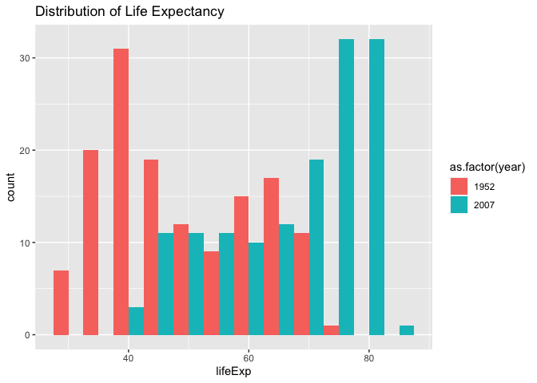
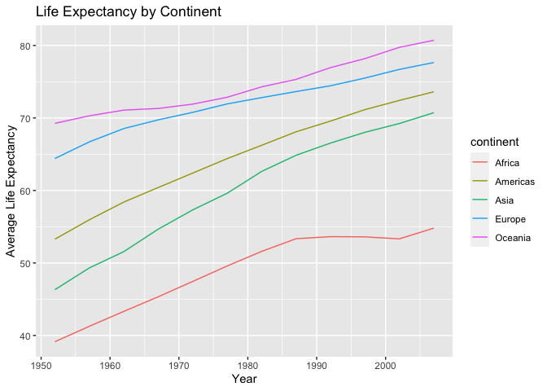
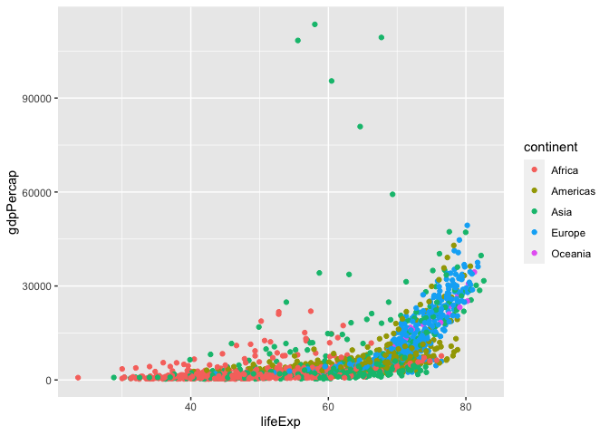
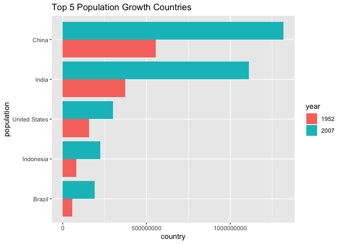
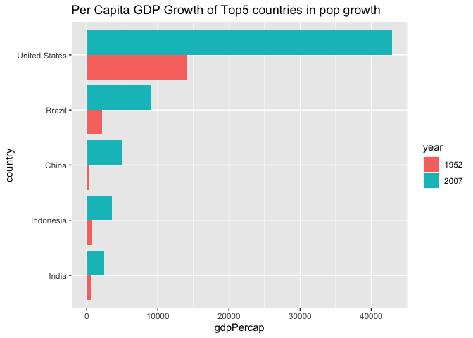
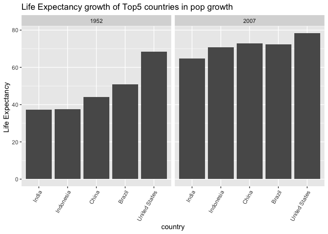

## Instructions
Answer the following questions and complete the exercises in RMarkdown. Please embed all of your code and push your final work to your repository. Your final lab report should be organized, clean, and run free from errors. Remember, you must remove the `#` for the included code chunks to run. Be sure to add your name to the author header above. For any included plots, make sure they are clearly labeled. You are free to use any plot type that you feel best communicates the results of your analysis.  

**In this homework, you should make use of the aesthetics you have learned. It's OK to be flashy!**

Make sure to use the formatting conventions of RMarkdown to make your report neat and clean!  

## Load the libraries

```r
library(tidyverse)
library(janitor)
library(here)
library(naniar)
library(RColorBrewer)
library(paletteer)
```


```r
options(scipen = 999)
```

## Resources
The idea for this assignment came from [Rebecca Barter's](http://www.rebeccabarter.com/blog/2017-11-17-ggplot2_tutorial/) ggplot tutorial so if you get stuck this is a good place to have a look.  

## Gapminder
For this assignment, we are going to use the dataset [gapminder](https://cran.r-project.org/web/packages/gapminder/index.html). Gapminder includes information about economics, population, and life expectancy from countries all over the world. You will need to install it before use. This is the same data that we will use for midterm 2 so this is good practice.

```r
#install.packages("gapminder")
library("gapminder")
```

## Questions
The questions below are open-ended and have many possible solutions. Your approach should, where appropriate, include numerical summaries and visuals. Be creative; assume you are building an analysis that you would ultimately present to an audience of stakeholders. Feel free to try out different `geoms` if they more clearly present your results.  

**1. Use the function(s) of your choice to get an idea of the overall structure of the data frame, including its dimensions, column names, variable classes, etc. As part of this, determine how NAs are treated in the data.**  

```r
gapminder <- gapminder
```


```r
names(gapminder)
```

```
## [1] "country"   "continent" "year"      "lifeExp"   "pop"       "gdpPercap"
```


```r
glimpse(gapminder)
```

```
## Rows: 1,704
## Columns: 6
## $ country   <fct> "Afghanistan", "Afghanistan", "Afghanistan", "Afghanistan", …
## $ continent <fct> Asia, Asia, Asia, Asia, Asia, Asia, Asia, Asia, Asia, Asia, …
## $ year      <int> 1952, 1957, 1962, 1967, 1972, 1977, 1982, 1987, 1992, 1997, …
## $ lifeExp   <dbl> 28.801, 30.332, 31.997, 34.020, 36.088, 38.438, 39.854, 40.8…
## $ pop       <int> 8425333, 9240934, 10267083, 11537966, 13079460, 14880372, 12…
## $ gdpPercap <dbl> 779.4453, 820.8530, 853.1007, 836.1971, 739.9811, 786.1134, …
```


```r
summary(gapminder)
```

```
##         country        continent        year         lifeExp     
##  Afghanistan:  12   Africa  :624   Min.   :1952   Min.   :23.60  
##  Albania    :  12   Americas:300   1st Qu.:1966   1st Qu.:48.20  
##  Algeria    :  12   Asia    :396   Median :1980   Median :60.71  
##  Angola     :  12   Europe  :360   Mean   :1980   Mean   :59.47  
##  Argentina  :  12   Oceania : 24   3rd Qu.:1993   3rd Qu.:70.85  
##  Australia  :  12                  Max.   :2007   Max.   :82.60  
##  (Other)    :1632                                                
##       pop               gdpPercap       
##  Min.   :     60011   Min.   :   241.2  
##  1st Qu.:   2793664   1st Qu.:  1202.1  
##  Median :   7023596   Median :  3531.8  
##  Mean   :  29601212   Mean   :  7215.3  
##  3rd Qu.:  19585222   3rd Qu.:  9325.5  
##  Max.   :1318683096   Max.   :113523.1  
## 
```


```r
naniar::miss_var_summary(gapminder)
```

```
## # A tibble: 6 × 3
##   variable  n_miss pct_miss
##   <chr>      <int>    <dbl>
## 1 country        0        0
## 2 continent      0        0
## 3 year           0        0
## 4 lifeExp        0        0
## 5 pop            0        0
## 6 gdpPercap      0        0
```

**2. Among the interesting variables in gapminder is life expectancy. How has global life expectancy changed between 1952 and 2007?**

```r
## life expectancy change from 1952 to 2007
lifechange <- gapminder%>%
  group_by(year)%>%
  summarize(lifexp_change = mean(lifeExp)); lifechange
```

```
## # A tibble: 12 × 2
##     year lifexp_change
##    <int>         <dbl>
##  1  1952          49.1
##  2  1957          51.5
##  3  1962          53.6
##  4  1967          55.7
##  5  1972          57.6
##  6  1977          59.6
##  7  1982          61.5
##  8  1987          63.2
##  9  1992          64.2
## 10  1997          65.0
## 11  2002          65.7
## 12  2007          67.0
```


```r
#Life expectancy change of 1952 and 2007

gapminder%>%
  filter(year %in% c(1952, 2007))%>%
  group_by(year)%>%
  summarize(lifexp_change = mean(lifeExp))
```

```
## # A tibble: 2 × 2
##    year lifexp_change
##   <int>         <dbl>
## 1  1952          49.1
## 2  2007          67.0
```


**3. How do the distributions of life expectancy compare for the years 1952 and 2007?**

```r
gapminder%>%
  filter(year == "1952" | year == "2007")%>%
  ggplot(aes(x = lifeExp, fill = as.factor(year))) +
  geom_histogram(position = "dodge", binwidth = 5)+
  labs(title = "Distribution of Life Expectancy")
```

<!-- -->

**4. Your answer above doesn't tell the whole story since life expectancy varies by region. Make a summary that shows the min, mean, and max life expectancy by continent for all years represented in the data.**

```r
gapminder%>%
  group_by(year, continent)%>%
  summarize(min = min(lifeExp),
            mean = mean(lifeExp),
            max = max(lifeExp))
```

```
## `summarise()` has grouped output by 'year'. You can override using the
## `.groups` argument.
```

```
## # A tibble: 60 × 5
## # Groups:   year [12]
##     year continent   min  mean   max
##    <int> <fct>     <dbl> <dbl> <dbl>
##  1  1952 Africa     30    39.1  52.7
##  2  1952 Americas   37.6  53.3  68.8
##  3  1952 Asia       28.8  46.3  65.4
##  4  1952 Europe     43.6  64.4  72.7
##  5  1952 Oceania    69.1  69.3  69.4
##  6  1957 Africa     31.6  41.3  58.1
##  7  1957 Americas   40.7  56.0  70.0
##  8  1957 Asia       30.3  49.3  67.8
##  9  1957 Europe     48.1  66.7  73.5
## 10  1957 Oceania    70.3  70.3  70.3
## # ℹ 50 more rows
```

**5. How has life expectancy changed between 1952-2007 for each continent?**

```r
gapminder%>%
  group_by(year, continent)%>%
  summarize(lc = mean(lifeExp, na.rm = T),.groups= "keep")%>%
  ggplot(aes(x = year, y = lc, color = continent))+
  geom_line()+
  labs(title = "Life Expectancy by Continent",
       x = "Year",
       y = "Average Life Expectancy")
```

<!-- -->

**6. We are interested in the relationship between per capita GDP and life expectancy; i.e. does having more money help you live longer?**

```r
gapminder%>%
  ggplot(aes(y =  gdpPercap, x = lifeExp, color = continent))+
  geom_point()
```

<!-- -->

**7. Which countries have had the largest population growth since 1952?**

```r
gapminder%>%
  group_by(country)%>%
  summarize(start = first(pop),
            end = last(pop),
            pop_growth = (end-start))%>%
  arrange(desc(pop_growth))
```

```
## # A tibble: 142 × 4
##    country           start        end pop_growth
##    <fct>             <int>      <int>      <int>
##  1 China         556263527 1318683096  762419569
##  2 India         372000000 1110396331  738396331
##  3 United States 157553000  301139947  143586947
##  4 Indonesia      82052000  223547000  141495000
##  5 Brazil         56602560  190010647  133408087
##  6 Pakistan       41346560  169270617  127924057
##  7 Bangladesh     46886859  150448339  103561480
##  8 Nigeria        33119096  135031164  101912068
##  9 Mexico         30144317  108700891   78556574
## 10 Philippines    22438691   91077287   68638596
## # ℹ 132 more rows
```

China has the largest population growth since 1952

**8. Use your results from the question above to plot population growth for the top five countries since 1952.**

```r
gapminder$year <- as.factor(gapminder$year)

top5 <- gapminder%>%
  filter(year %in% c(1952, 2007))%>%
  group_by(country)%>%
  summarize(start = first(pop),
            end = last(pop),
            pop_growth = (end-start))%>%
  arrange(desc(pop_growth))%>%
  top_n(5,pop_growth);top5
```

```
## # A tibble: 5 × 4
##   country           start        end pop_growth
##   <fct>             <int>      <int>      <int>
## 1 China         556263527 1318683096  762419569
## 2 India         372000000 1110396331  738396331
## 3 United States 157553000  301139947  143586947
## 4 Indonesia      82052000  223547000  141495000
## 5 Brazil         56602560  190010647  133408087
```


```r
gapminder%>%
  filter(year %in%c(1952, 2007) & country %in% top5$country)%>%
  ggplot(aes(x = reorder(country, pop), y = pop, fill = year))+
  geom_bar(stat = "identity", position = "dodge")+
  coord_flip()+
  labs(title = "Top 5 Population Growth Countries", x = "population", y = "country")
```

<!-- -->


**9. How does per capita GDP growth compare between these same five countries?**

```r
top_gdp <- gapminder%>%
  filter(year %in% c(1952, 2007)& country%in%top5$country)%>%
  group_by(country)%>%
  summarize(start_gdp = first(gdpPercap),
            end_gdp = last(gdpPercap),
            gdp_growth = (end_gdp-start_gdp))%>%
  arrange(desc(gdp_growth))%>%
  top_n(5,gdp_growth);top_gdp
```

```
## # A tibble: 5 × 4
##   country       start_gdp end_gdp gdp_growth
##   <fct>             <dbl>   <dbl>      <dbl>
## 1 United States    13990.  42952.     28961.
## 2 Brazil            2109.   9066.      6957.
## 3 China              400.   4959.      4559.
## 4 Indonesia          750.   3541.      2791.
## 5 India              547.   2452.      1906.
```

```r
gapminder%>%
  filter(year %in% c(1952, 2007)& country%in%top5$country)%>%
  ggplot(aes(x = reorder(country, gdpPercap), y = gdpPercap, fill = year))+
  geom_bar(stat = "identity", position = "dodge")+
  coord_flip()+
  labs(title = "Per Capita GDP Growth of Top5 countries in pop growth ", x
       = "country", y = "gdpPercap")
```

<!-- -->

**10. Make one plot of your choice that uses faceting!**


How does Life expectancy growth compare between these same five countries?

```r
top5_life <- gapminder%>%
  filter(year %in% c(1952, 2007)& country%in%top5$country)%>%
  group_by(country)%>%
  summarize(start_life = first(lifeExp),
            end_life = last(lifeExp),
            life_growth = (end_life - start_life))%>%
  arrange(desc( life_growth))%>%
  top_n(5, life_growth);top5_life
```

```
## # A tibble: 5 × 4
##   country       start_life end_life life_growth
##   <fct>              <dbl>    <dbl>       <dbl>
## 1 Indonesia           37.5     70.6       33.2 
## 2 China               44       73.0       29.0 
## 3 India               37.4     64.7       27.3 
## 4 Brazil              50.9     72.4       21.5 
## 5 United States       68.4     78.2        9.80
```

```r
gapminder%>%
  filter(year %in% c(1952, 2007)& country%in%top5$country)%>%
  ggplot(aes(x = reorder(country, lifeExp), y = lifeExp))+
  geom_bar(stat = "identity", position = "dodge")+
  facet_wrap(year~.)+
  theme(axis.text.x = element_text(angle = 60, hjust=1))+
  labs(title = "Life Expectancy growth of Top5 countries in pop growth", x = "country", y = "Life Expectancy ")
```

<!-- -->

## Push your final code to GitHub!
Please be sure that you check the `keep md` file in the knit preferences. 
