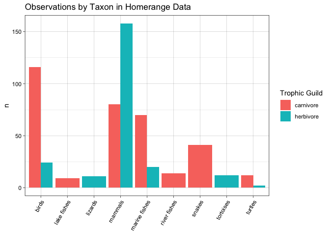
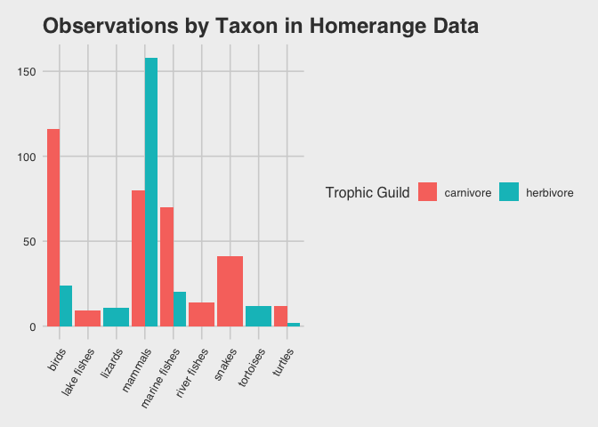
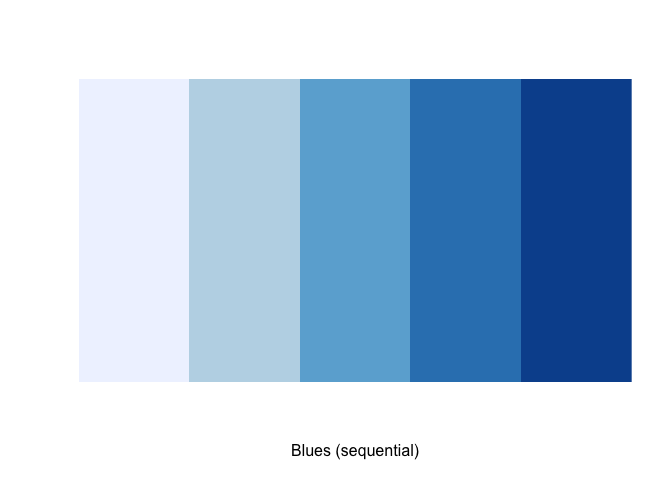
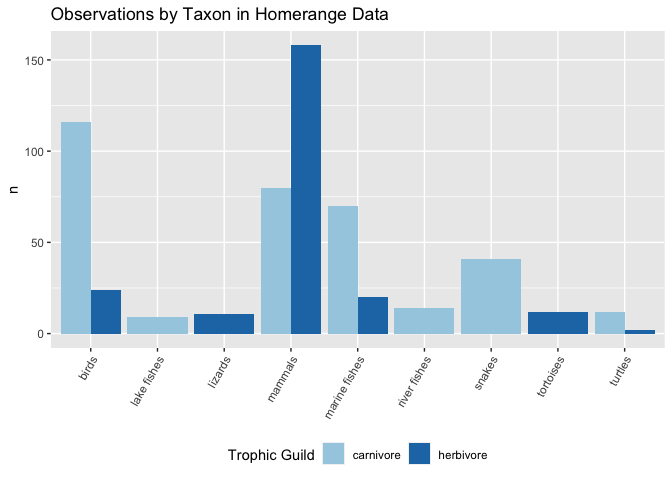
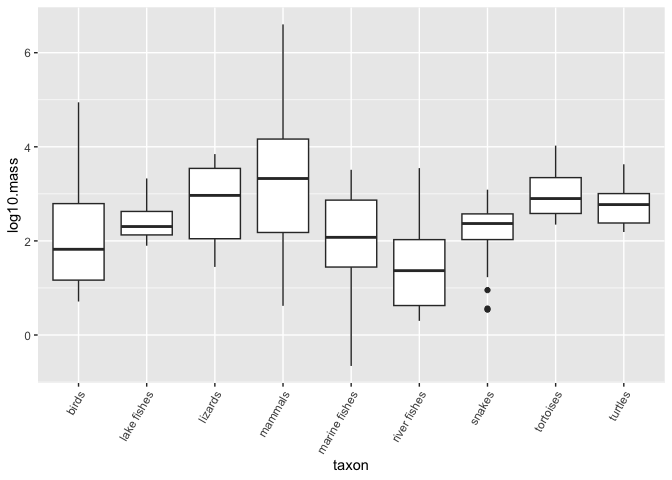
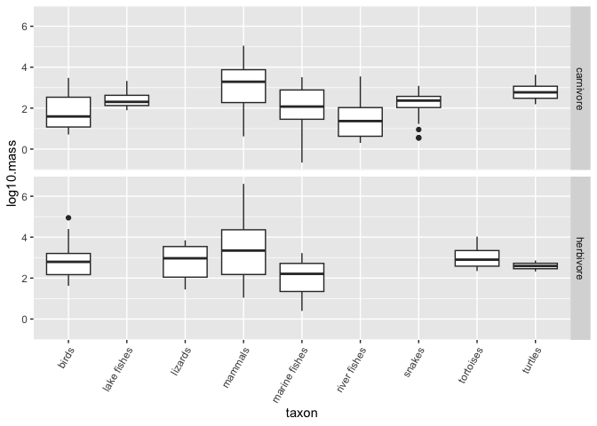
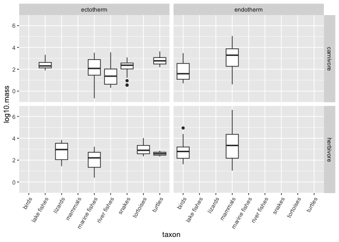

## Learning Goals
*At the end of this exercise, you will be able to:*    
1. Adjust the aesthetics of plots in ggplot using `themes`, `RColorBrewer`, and `paletteer.`  
2. Use faceting to produce multi-panel plots.  

## Resources
- [ggplot2 cheatsheet](https://www.rstudio.com/wp-content/uploads/2015/03/ggplot2-cheatsheet.pdf)
- [R for Data Science](https://r4ds.had.co.nz/)
- [R Cookbook](http://www.cookbook-r.com/)
- [`ggplot` themes](https://ggplot2.tidyverse.org/reference/ggtheme.html)
- [Rebecca Barter `ggplot` Tutorial](http://www.rebeccabarter.com/blog/2017-11-17-ggplot2_tutorial/)
- [R Color Brewer](http://colorbrewer2.org/#type=sequential&scheme=BuGn&n=3)

## Load the libraries

```r
library(tidyverse)
library(RColorBrewer)
library(paletteer)
library(janitor)
```


```r
options(scipen=999) #cancels the use of scientific notation for the session
```

## Data
For this tutorial, we will use:  
[Homerange](http://datadryad.org/resource/doi:10.5061/dryad.q5j65/1). The data are from: Tamburello N, Cote IM, Dulvy NK (2015) Energy and the scaling of animal space use. The American Naturalist 186(2):196-211. http://dx.doi.org/10.1086/682070.  

```r
homerange <- read_csv("data/Tamburelloetal_HomeRangeDatabase.csv", na = c("", "NA", "\\"))
```

## ggplot themes
There are many options to change the theme of your plots within ggplot. Have a look [here]https://ggplot2.tidyverse.org/reference/ggtheme.html) for a list of the themes.  

Let's start by building a simple barplot.  

```r
p <- homerange %>% 
  ggplot(aes(x=taxon, fill=trophic.guild))+
  geom_bar(na.rm=T, position="dodge");p
```

<!-- -->

Have a look at the `linedraw` theme; I am adding it as another layer.

```r
p + theme_linedraw()+
  theme(axis.text.x = element_text(angle = 60, hjust=1))+
  labs(title = "Observations by Taxon in Homerange Data",
       x = NULL,
       y= "n",
       fill= "Trophic Guild")
```

<!-- -->

## Practice
1. Build a scatterplot that compares `log10.mass` and `log10.preymass`. Color the points by `taxon`. Store this plot as object `q`.

```r
q <- homerange%>%
  ggplot(aes(log10.mass, log10.preymass,color = taxon))+
  geom_point();q
```

```
## Warning: Removed 502 rows containing missing values (`geom_point()`).
```

<!-- -->

2. Use plot `q` but add the classic theme.

```r
q+theme_classic()
```

```
## Warning: Removed 502 rows containing missing values (`geom_point()`).
```

<!-- -->

## Legends
There are lots of options to manipulate legends. Have a look [here](http://www.sthda.com/english/wiki/ggplot2-legend-easy-steps-to-change-the-position-and-the-appearance-of-a-graph-legend-in-r-software).

```r
p+theme_linedraw()+
  theme(legend.position = "right",
        axis.text.x = element_text(angle = 60, hjust=1))+
  labs(title = "Observations by Taxon in Homerange Data",
       x = NULL, # remove the name of x-axis
       y= "n",
       fill= "Trophic Guild")
```

<!-- -->


## Not enough? Try using `ggthemes`
There are many packages that include additional themes, one of which is [ggthemes](https://yutannihilation.github.io/allYourFigureAreBelongToUs/). Some of these are nice because they are designed to mimic the look of popular publications.

```r
#install.packages("ggthemes")
library(ggthemes)
```

```
## Warning: package 'ggthemes' was built under R version 4.3.2
```

Here is a list of the `ggthemes`

```r
#ls("package:ggthemes")[grepl("theme_", ls("package:ggthemes"))]
```


```r
p + 
  theme_fivethirtyeight()+
  theme(legend.position = "right",
        axis.text.x = element_text(angle = 60, hjust=1))+
  labs(title = "Observations by Taxon in Homerange Data",
       x = NULL,
       y= "n",
       fill= "Trophic Guild")
```

<!-- -->

## Practice
1. Use plot `q` and try the `theme_economist()` theme.


## RColorBrewer
The default colors used by ggplot are often uninspiring. They don't make plots pop out in presentations or publications, and you may want to use a customized palette to make things visually consistent.  

Access the help for `RColorBrewer`.

```r
?RColorBrewer
```

The thing to notice is that there are three different color palettes: 1) sequential, 2) diverging, and 3) qualitative. Within each of these there are several selections. You can bring up the colors by using `display.brewer.pal()`. Specify the number of colors that you want and the palette name.

```r
display.brewer.pal(5,"Blues") #sequential palette
```

<!-- -->

The [R Color Brewer](http://colorbrewer2.org/#type=sequential&scheme=BuGn&n=3) website is very helpful for getting an idea of the color palettes. To make things easy, use these two guidelines:

+`scale_colour_brewer()` is for points  
+`scale_fill_brewer()` is for fills  

Here I chose the `Paired` palette. Take a moment and experiment with other options.

```r
p+scale_fill_brewer(palette = "Paired")+
  theme(legend.position = "bottom",
        axis.text.x = element_text(angle = 60, hjust=1))+
  labs(title = "Observations by Taxon in Homerange Data",
       x = NULL,
       y= "n",
       fill= "Trophic Guild")
```

<!-- -->

## Practice
1. Keep using the `same `q` plot, but test out one of R Color Brewer palettes.

```r
q+scale_color_brewer(palette = "PuBuGn")
```

```
## Warning: Removed 502 rows containing missing values (`geom_point()`).
```

<!-- -->

## Manually Setting Colors
You can also use `paleteer` to build a custom palette for consistency. To access the `paleteer` collection, I add it to a new object.

```r
colors <- paletteer::palettes_d_names
```

Now we can display the palettes. Assign the palette to `my_palette` and then build this base R bar plot. There are a lot of options; `paleteer` is a collection of popular palettes. I really like the [`ggsci` package] (https://cran.r-project.org/web/packages/ggsci/vignettes/ggsci.html)

```r
my_palette <- paletteer_d("futurevisions::atomic_orange")
```


```r
barplot(rep(1,6), axes=FALSE, col=my_palette)
```

<!-- -->

Now we just identify `my_palette` as part of `scale_fill_manual()`

```r
p+scale_fill_manual(values=my_palette)+
  theme(legend.position = "bottom",
        axis.text.x = element_text(angle = 60, hjust=1))+
  labs(title = "Observations by Taxon in Homerange Data",
       x = NULL,
       y= "n",
       fill= "Trophic Guild")
```

<!-- -->

## Practice
1. Keep using the `same `q` plot, but test out one of `paleteer` themes.


## Faceting
[Faceting](https://ggplot2-book.org/facet.html) is one of the amazing features of ggplot. It allows us to make multi-panel plots for easy comparison.  Here is a boxplot that shows the range of log10.mass by taxon.

```r
homerange %>% 
  ggplot(aes(x=taxon, y=log10.mass))+
  geom_boxplot()+
  theme(axis.text.x = element_text(angle = 60, hjust=1))
```

<!-- -->

There are other categorical variables that might be interesting to overlay. `facet_wrap()` makes a ribbon of panels by a specified categorical variable and allows you to control how you want them arranged.  

```r
homerange %>% 
  ggplot(aes(x=taxon, y=log10.mass))+
  geom_boxplot()+
  facet_wrap(~trophic.guild)+ #shape in cols
  theme(axis.text.x = element_text(angle = 60, hjust=1))
```

<!-- -->

`facet_grid()` allows control over the faceted variable; it can be arranged in rows or columns. rows~columns. 

```r
homerange %>% 
  ggplot(aes(x=taxon, y=log10.mass))+
  geom_boxplot()+
  facet_grid(trophic.guild~.)+ # splice in rows
  theme(axis.text.x = element_text(angle = 60, hjust=1))
```

<!-- -->

`facet_grid()` will also allow the comparison of two categorical variables, just remember a~b where a is rows and b is columns.  

```r
homerange %>% 
  ggplot(aes(x=taxon, y=log10.mass))+
  geom_boxplot()+
  facet_grid(trophic.guild~thermoregulation)+ # 
  theme(axis.text.x = element_text(angle = 60, hjust=1))
```

<!-- -->

## Practice
1. Use facet_wrap to compare the distribution of `log10.mass` by `thermoregulation`.


2. Use facet_grid to compare the distribution of `log10.mass` by `locomotion`.


## Wrap-up  

Please review the learning goals and be sure to use the code here as a reference when completing the homework.    
-->[Home](https://jmledford3115.github.io/datascibiol/)
