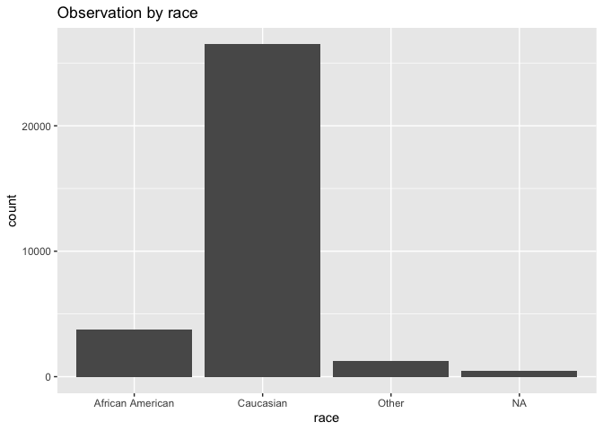
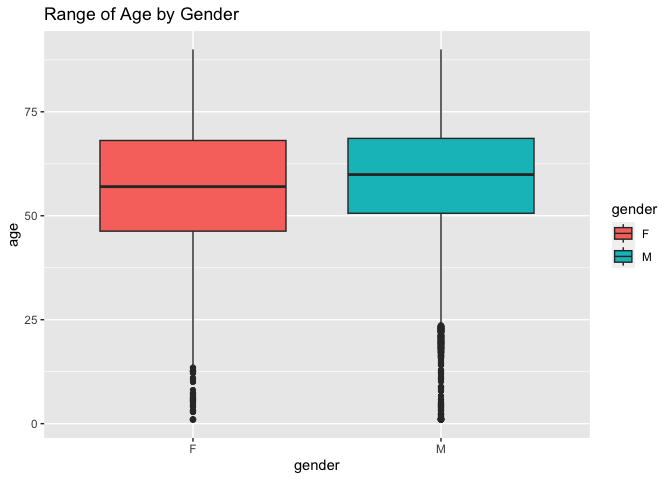
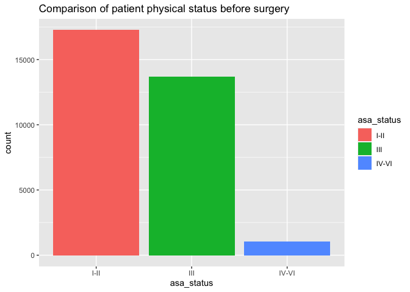
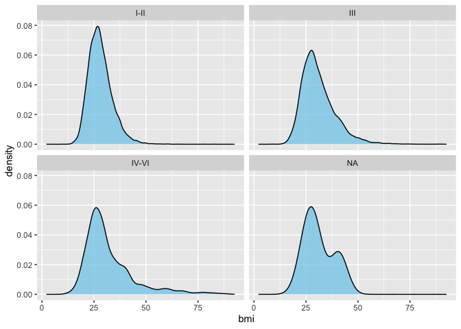

## Instructions
Answer the following questions and complete the exercises in RMarkdown. Please embed all of your code and push your final work to your repository. Your code should be organized, clean, and run free from errors. Remember, you must remove the `#` for any included code chunks to run. Be sure to add your name to the author header above.  

Make sure to use the formatting conventions of RMarkdown to make your report neat and clean! Use the tidyverse and pipes unless otherwise indicated. To receive full credit, all plots must have clearly labeled axes, a title, and consistent aesthetics. This exam is worth a total of 35 points. 

Please load the following libraries.

```r
library("tidyverse")
library("janitor")
library("naniar")
```

## Data
These data are from a study on surgical residents. The study was originally published by Sessier et al. “Operation Timing and 30-Day Mortality After Elective General Surgery”. Anesth Analg 2011; 113: 1423-8. The data were cleaned for instructional use by Amy S. Nowacki, “Surgery Timing Dataset”, TSHS Resources Portal (2016). Available at https://www.causeweb.org/tshs/surgery-timing/.

Descriptions of the variables and the study are included as pdf's in the data folder.  

Please run the following chunk to import the data.

```r
surgery <- read_csv("data/surgery.csv")
```

1. Use the summary function(s) of your choice to explore the data and get an idea of its structure. Please also check for NA's.


```r
str(surgery)
```

```
## spc_tbl_ [32,001 × 25] (S3: spec_tbl_df/tbl_df/tbl/data.frame)
##  $ ahrq_ccs           : chr [1:32001] "<Other>" "<Other>" "<Other>" "<Other>" ...
##  $ age                : num [1:32001] 67.8 39.5 56.5 71 56.3 57.7 56.6 64.2 66.2 20.1 ...
##  $ gender             : chr [1:32001] "M" "F" "F" "M" ...
##  $ race               : chr [1:32001] "Caucasian" "Caucasian" "Caucasian" "Caucasian" ...
##  $ asa_status         : chr [1:32001] "I-II" "I-II" "I-II" "III" ...
##  $ bmi                : num [1:32001] 28 37.9 19.6 32.2 24.3 ...
##  $ baseline_cancer    : chr [1:32001] "No" "No" "No" "No" ...
##  $ baseline_cvd       : chr [1:32001] "Yes" "Yes" "No" "Yes" ...
##  $ baseline_dementia  : chr [1:32001] "No" "No" "No" "No" ...
##  $ baseline_diabetes  : chr [1:32001] "No" "No" "No" "No" ...
##  $ baseline_digestive : chr [1:32001] "Yes" "No" "No" "No" ...
##  $ baseline_osteoart  : chr [1:32001] "No" "No" "No" "No" ...
##  $ baseline_psych     : chr [1:32001] "No" "No" "No" "No" ...
##  $ baseline_pulmonary : chr [1:32001] "No" "No" "No" "No" ...
##  $ baseline_charlson  : num [1:32001] 0 0 0 0 0 0 2 0 1 2 ...
##  $ mortality_rsi      : num [1:32001] -0.63 -0.63 -0.49 -1.38 0 -0.77 -0.36 -0.64 0.02 0.73 ...
##  $ complication_rsi   : num [1:32001] -0.26 -0.26 0 -1.15 0 -0.84 -1.34 0.09 0.02 0 ...
##  $ ccsmort30rate      : num [1:32001] 0.00425 0.00425 0.00425 0.00425 0.00425 ...
##  $ ccscomplicationrate: num [1:32001] 0.0723 0.0723 0.0723 0.0723 0.0723 ...
##  $ hour               : num [1:32001] 9.03 18.48 7.88 8.8 12.2 ...
##  $ dow                : chr [1:32001] "Mon" "Wed" "Fri" "Wed" ...
##  $ month              : chr [1:32001] "Nov" "Sep" "Aug" "Jun" ...
##  $ moonphase          : chr [1:32001] "Full Moon" "New Moon" "Full Moon" "Last Quarter" ...
##  $ mort30             : chr [1:32001] "No" "No" "No" "No" ...
##  $ complication       : chr [1:32001] "No" "No" "No" "No" ...
##  - attr(*, "spec")=
##   .. cols(
##   ..   ahrq_ccs = col_character(),
##   ..   age = col_double(),
##   ..   gender = col_character(),
##   ..   race = col_character(),
##   ..   asa_status = col_character(),
##   ..   bmi = col_double(),
##   ..   baseline_cancer = col_character(),
##   ..   baseline_cvd = col_character(),
##   ..   baseline_dementia = col_character(),
##   ..   baseline_diabetes = col_character(),
##   ..   baseline_digestive = col_character(),
##   ..   baseline_osteoart = col_character(),
##   ..   baseline_psych = col_character(),
##   ..   baseline_pulmonary = col_character(),
##   ..   baseline_charlson = col_double(),
##   ..   mortality_rsi = col_double(),
##   ..   complication_rsi = col_double(),
##   ..   ccsmort30rate = col_double(),
##   ..   ccscomplicationrate = col_double(),
##   ..   hour = col_double(),
##   ..   dow = col_character(),
##   ..   month = col_character(),
##   ..   moonphase = col_character(),
##   ..   mort30 = col_character(),
##   ..   complication = col_character()
##   .. )
##  - attr(*, "problems")=<externalptr>
```


```r
summary(surgery)
```

```
##    ahrq_ccs              age           gender              race          
##  Length:32001       Min.   : 1.00   Length:32001       Length:32001      
##  Class :character   1st Qu.:48.20   Class :character   Class :character  
##  Mode  :character   Median :58.60   Mode  :character   Mode  :character  
##                     Mean   :57.66                                        
##                     3rd Qu.:68.30                                        
##                     Max.   :90.00                                        
##                     NA's   :2                                            
##   asa_status             bmi        baseline_cancer    baseline_cvd      
##  Length:32001       Min.   : 2.15   Length:32001       Length:32001      
##  Class :character   1st Qu.:24.60   Class :character   Class :character  
##  Mode  :character   Median :28.19   Mode  :character   Mode  :character  
##                     Mean   :29.45                                        
##                     3rd Qu.:32.81                                        
##                     Max.   :92.59                                        
##                     NA's   :3290                                         
##  baseline_dementia  baseline_diabetes  baseline_digestive baseline_osteoart 
##  Length:32001       Length:32001       Length:32001       Length:32001      
##  Class :character   Class :character   Class :character   Class :character  
##  Mode  :character   Mode  :character   Mode  :character   Mode  :character  
##                                                                             
##                                                                             
##                                                                             
##                                                                             
##  baseline_psych     baseline_pulmonary baseline_charlson mortality_rsi    
##  Length:32001       Length:32001       Min.   : 0.000    Min.   :-4.4000  
##  Class :character   Class :character   1st Qu.: 0.000    1st Qu.:-1.2400  
##  Mode  :character   Mode  :character   Median : 0.000    Median :-0.3000  
##                                        Mean   : 1.184    Mean   :-0.5316  
##                                        3rd Qu.: 2.000    3rd Qu.: 0.0000  
##                                        Max.   :13.000    Max.   : 4.8600  
##                                                                           
##  complication_rsi  ccsmort30rate      ccscomplicationrate      hour      
##  Min.   :-4.7200   Min.   :0.000000   Min.   :0.01612     Min.   : 6.00  
##  1st Qu.:-0.8400   1st Qu.:0.000789   1st Qu.:0.08198     1st Qu.: 7.65  
##  Median :-0.2700   Median :0.002764   Median :0.10937     Median : 9.65  
##  Mean   :-0.4091   Mean   :0.004312   Mean   :0.13325     Mean   :10.38  
##  3rd Qu.: 0.0000   3rd Qu.:0.007398   3rd Qu.:0.18337     3rd Qu.:12.72  
##  Max.   :13.3000   Max.   :0.016673   Max.   :0.46613     Max.   :19.00  
##                                                                          
##      dow               month            moonphase            mort30         
##  Length:32001       Length:32001       Length:32001       Length:32001      
##  Class :character   Class :character   Class :character   Class :character  
##  Mode  :character   Mode  :character   Mode  :character   Mode  :character  
##                                                                             
##                                                                             
##                                                                             
##                                                                             
##  complication      
##  Length:32001      
##  Class :character  
##  Mode  :character  
##                    
##                    
##                    
## 
```


```r
surgery%>%map_df(~ sum(is.na(.)))
```

```
## # A tibble: 1 × 25
##   ahrq_ccs   age gender  race asa_status   bmi baseline_cancer baseline_cvd
##      <int> <int>  <int> <int>      <int> <int>           <int>        <int>
## 1        0     2      3   480          8  3290               0            0
## # ℹ 17 more variables: baseline_dementia <int>, baseline_diabetes <int>,
## #   baseline_digestive <int>, baseline_osteoart <int>, baseline_psych <int>,
## #   baseline_pulmonary <int>, baseline_charlson <int>, mortality_rsi <int>,
## #   complication_rsi <int>, ccsmort30rate <int>, ccscomplicationrate <int>,
## #   hour <int>, dow <int>, month <int>, moonphase <int>, mort30 <int>,
## #   complication <int>
```

```r
miss_var_summary(surgery)
```

```
## # A tibble: 25 × 3
##    variable          n_miss pct_miss
##    <chr>              <int>    <dbl>
##  1 bmi                 3290 10.3    
##  2 race                 480  1.50   
##  3 asa_status             8  0.0250 
##  4 gender                 3  0.00937
##  5 age                    2  0.00625
##  6 ahrq_ccs               0  0      
##  7 baseline_cancer        0  0      
##  8 baseline_cvd           0  0      
##  9 baseline_dementia      0  0      
## 10 baseline_diabetes      0  0      
## # ℹ 15 more rows
```

There are some NA'a in age, geneder, asa_status, race and bmi


2. Let's explore the participants in the study. Show a count of participants by race AND make a plot that visually represents your output.

```r
surgery%>%
  count(race, sort = T)
```

```
## # A tibble: 4 × 2
##   race                 n
##   <chr>            <int>
## 1 Caucasian        26488
## 2 African American  3790
## 3 Other             1243
## 4 <NA>               480
```


```r
surgery%>%
  ggplot(aes(race))+
  geom_bar()+
  labs( title = "Observation by race")
```

<!-- -->

3. What is the mean age of participants by gender? (hint: please provide a number for each) Since only three participants do not have gender indicated, remove these participants from the data.


```r
surgery%>%
  filter(gender != "NA")%>%
  group_by(gender)%>%
  summarize(mean_age = mean(age, na.rm = T))
```

```
## # A tibble: 2 × 2
##   gender mean_age
##   <chr>     <dbl>
## 1 F          56.7
## 2 M          58.8
```


4. Make a plot that shows the range of age associated with gender.

```r
surgery%>%
  filter(gender != "NA" & age != "NA")%>% 
  ggplot(aes(x = gender, y = age, fill = gender))+
  geom_boxplot()+ # gemo_boxplot(na.rm = T)
  labs(title = "Range of Age by Gender")
```

<!-- -->

5. How healthy are the participants? The variable `asa_status` is an evaluation of patient physical status prior to surgery. Lower numbers indicate fewer comorbidities (presence of two or more diseases or medical conditions in a patient). Make a plot that compares the number of `asa_status` I-II, III, and IV-V.


```r
surgery%>%
  filter(asa_status != "NA")%>%
  ggplot(aes(asa_status, fill = asa_status))+
  geom_bar()+
  labs(title = "Comparison of patient physical status before surgery")
```

<!-- -->

6. Create a plot that displays the distribution of body mass index for each `asa_status` as a probability distribution- not a histogram. (hint: use faceting!)

```r
surgery%>%
  ggplot(aes(x= bmi))+
  geom_density(na.rm = T, fill = "skyblue", alpha = 0.8)+
  facet_wrap(~ asa_status, ncol =2)
```

<!-- -->

The variable `ccsmort30rate` is a measure of the overall 30-day mortality rate associated with each type of operation. The variable `ccscomplicationrate` is a measure of the 30-day in-hospital complication rate. The variable `ahrq_ccs` lists each type of operation.  

7. What are the 5 procedures associated with highest risk of 30-day mortality AND how do they compare with the 5 procedures with highest risk of complication? (hint: no need for a plot here)

```r
surgery %>% 
  group_by(ahrq_ccs) %>% 
  summarise(h30rate=mean(ccsmort30rate)) %>% 
  arrange(desc(h30rate)) %>% 
  top_n(h30rate, n=5)
```

```
## # A tibble: 5 × 2
##   ahrq_ccs                                             h30rate
##   <chr>                                                  <dbl>
## 1 Colorectal resection                                 0.0167 
## 2 Small bowel resection                                0.0129 
## 3 Gastrectomy; partial and total                       0.0127 
## 4 Endoscopy and endoscopic biopsy of the urinary tract 0.00811
## 5 Spinal fusion                                        0.00742
```

```r
surgery %>% 
  group_by(ahrq_ccs) %>% 
  summarise(hcom=mean(ccscomplicationrate)) %>% 
  arrange(desc(hcom)) %>% 
  top_n(hcom, n=5)
```

```
## # A tibble: 5 × 2
##   ahrq_ccs                          hcom
##   <chr>                            <dbl>
## 1 Small bowel resection            0.466
## 2 Colorectal resection             0.312
## 3 Nephrectomy; partial or complete 0.197
## 4 Gastrectomy; partial and total   0.190
## 5 Spinal fusion                    0.183
```


8. Make a plot that compares the `ccsmort30rate` for all listed `ahrq_ccs` procedures.

```r
surgery%>%
  ggplot(aes(y = ccsmort30rate, x = ahrq_ccs))+
  geom_col(position="dodge",fill = "lightblue")+
  coord_flip()
```

<!-- -->


9. When is the best month to have surgery? Make a chart that shows the 30-day mortality and complications for the patients by month. `mort30` is the variable that shows whether or not a patient survived 30 days post-operation.

```r
surgery_new <- surgery %>%
  mutate(mort30_n = ifelse(mort30 == "Yes", 1, 0),
         complication_n = ifelse(complication =="Yes", 1, 0)) %>% 
  group_by(month) %>% 
  summarise(n_deaths=sum(mort30_n),
            n_comp=sum(complication_n))
surgery_new
```

```
## # A tibble: 12 × 3
##    month n_deaths n_comp
##    <chr>    <dbl>  <dbl>
##  1 Apr         12    321
##  2 Aug          9    462
##  3 Dec          4    237
##  4 Feb         17    343
##  5 Jan         19    407
##  6 Jul         12    301
##  7 Jun         14    410
##  8 Mar         12    324
##  9 May         10    333
## 10 Nov          5    325
## 11 Oct          8    377
## 12 Sep         16    424
```


```r
surgery %>% tabyl(month, mort30)
```

```
##  month   No Yes
##    Apr 2686  12
##    Aug 3168   9
##    Dec 1835   4
##    Feb 2489  17
##    Jan 2651  19
##    Jul 2313  12
##    Jun 2980  14
##    Mar 2685  12
##    May 2644  10
##    Nov 2539   5
##    Oct 2681   8
##    Sep 3192  16
```


```r
surgery %>% tabyl(month, complication)
```

```
##  month   No Yes
##    Apr 2377 321
##    Aug 2715 462
##    Dec 1602 237
##    Feb 2163 343
##    Jan 2263 407
##    Jul 2024 301
##    Jun 2584 410
##    Mar 2373 324
##    May 2321 333
##    Nov 2219 325
##    Oct 2312 377
##    Sep 2784 424
```

10. Make a plot that visualizes the chart from question #9. Make sure that the months are on the x-axis. Do a search online and figure out how to order the months Jan-Dec.


Please be 100% sure your exam is saved, knitted, and pushed to your github repository. No need to submit a link on canvas, we will find your exam in your repository.
